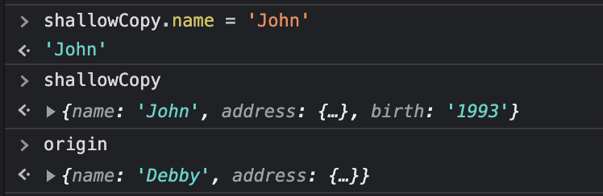
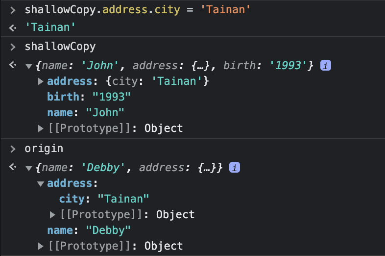
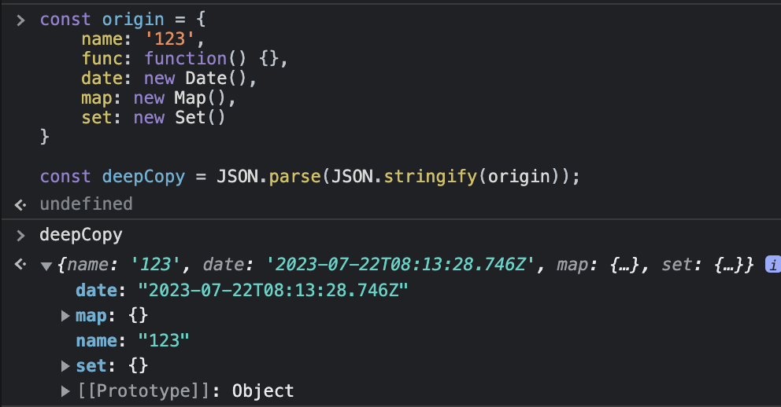

# Deep copy

## shallow vs. deep

shallow copy 使用 `Spread operator` (...)

```
const origin = {
    name: 'Debby',
    address: {
        city: 'New Taipei city'
    }
}
const shallowCopy = {...origin}
```

如果 shallow 新增 property 或第一層的值，不會影響到 origin



但如果是 shallow 改第二層以下的值，會影響到 origin



## Deep copy

### 1. JSON.parse & JSON.stringify

```
const origin = {
    name: 'Debby',
    address: {
        city: 'New Taipei city'
    }
}

const deepCopy = JSON.parse(JSON.stringify(origin));
```

但這個方法有幾個 property 沒辦法轉換



### 2. Lodash `cloneDeep()`

### 3. structuredClone()

```
const myDeepCopy = structuredClone(origin);
```

## Reference

- [Deep-copying in JavaScript using structuredClone @ web.dev](https://web.dev/structured-clone/)
